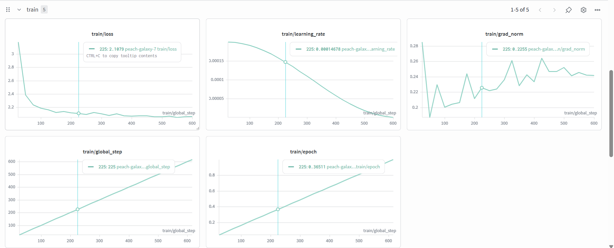
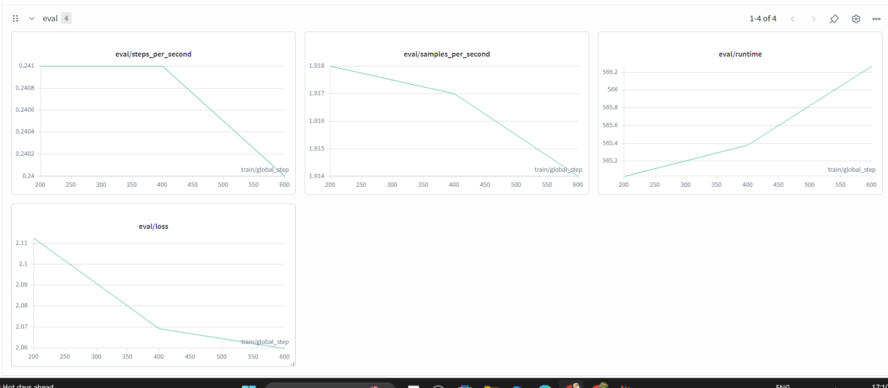
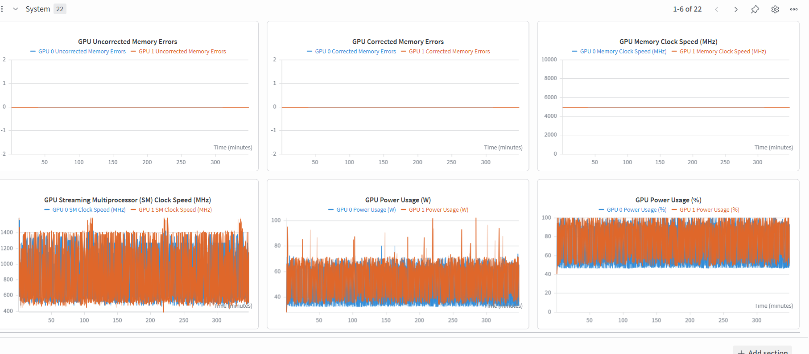

# 🩺 LLM Fine-tuning with QLoRA — Medical Question Answering

[](https://huggingface.co/mohdomer/mistral-7b-medical-qa-qlora)
[](https://huggingface.co/spaces/mohdomer/mistral-medical-qa-demo)
[](https://wandb.ai/asratabbssum-lords-institute-of-engineering-and-technology/mistral-medical-qlora/runs/tueb17vn)
[](https://python.org)
[](LICENSE)

Fine-tuning **Mistral-7B-Instruct-v0.2** on medical question answering using **QLoRA** — training on a single free T4 GPU in ~5.8 hours with consistent improvements across all evaluation metrics.

---

## What is QLoRA? (And why does it matter)

Full fine-tuning a 7B parameter model requires ~56 GB of VRAM — out of reach for most developers. **QLoRA (Quantized Low-Rank Adaptation)** solves this with two complementary tricks:

### 1 · 4-bit Quantisation (BitsAndBytes)
Instead of storing each weight as a 16-bit float, QLoRA uses **NormalFloat4 (NF4)** — a 4-bit data type optimised for normally-distributed neural network weights. This compresses the base model from ~14 GB → ~2 GB VRAM with minimal quality loss.

### 2 · LoRA Adapters (PEFT)
Rather than updating all 7 billion parameters, LoRA injects small **rank-decomposition matrices** into the attention layers:

```
W_updated = W_frozen + (B × A) × (alpha / r)
```

Where `A` and `B` are tiny trainable matrices with rank `r=64`. Only **~0.72% of parameters** are trained — the rest stay frozen in 4-bit.

```
Total params     :  6,738,415,616  (6.7B)
Trainable params :     27,262,976  (0.72%)
Frozen params    :  6,711,152,640
```

After training, adapters are **merged** back into the base weights — producing a standard model with no inference overhead.

---

## Project Structure

```
llm-finetuning/
├── notebooks/
│   └── full_training_walkthrough.ipynb   ← Main Kaggle/Colab notebook
├── src/
│   ├── data_prep.py                       ← Dataset loading & formatting
│   ├── model_setup.py                     ← 4-bit load + QLoRA config
│   ├── train.py                           ← SFTTrainer + W&B logging
│   ├── evaluate.py                        ← ROUGE + BLEU evaluation
│   └── push_model.py                      ← Merge LoRA + push to Hub
├── app.py                                 ← Gradio inference demo
├── results/
│   └── evaluation_report.json            ← Real evaluation results
├── requirements.txt
└── README.md
```

---

## Training Configuration

| Hyperparameter | Value | Notes |
|---|---|---|
| Base model | `mistralai/Mistral-7B-Instruct-v0.2` | 7B instruction-tuned |
| Quantisation | 4-bit NF4 | BitsAndBytes double-quant |
| LoRA rank (r) | 64 | Higher = more capacity |
| LoRA alpha | 16 | Effective scale = alpha/r |
| LoRA dropout | 0.1 | Regularisation |
| Target modules | `q_proj`, `v_proj` | Key attention projections |
| Trainable params | 27.3M (0.72%) | vs 6.7B total |
| Epochs | 1 | Free T4 GPU time constraint |
| Batch size (effective) | 16 | 2 per device × 8 accumulation |
| Learning rate | 2e-4 | |
| LR scheduler | Cosine with warmup | |
| Optimiser | `paged_adamw_8bit` | Memory-efficient |
| Max sequence length | 512 tokens | |
| Training time | ~5.8 hours | Kaggle T4 GPU (16 GB) |
| Peak GPU VRAM | ~2.27 GB | Thanks to 4-bit quant |
| Dataset | ChatDoctor-HealthCareMagic-100k | 20k subsampled |

---

## Dataset

**[ChatDoctor-HealthCareMagic-100k](https://huggingface.co/datasets/lavita/ChatDoctor-HealthCareMagic-100k)** — 100k real patient–doctor conversations from HealthCareMagic online medical platform.

Each example formatted into Mistral instruction template:

```
<s>[INST] You are a knowledgeable medical assistant.
Answer the following medical question accurately and clearly.

{patient_question} [/INST] {doctor_answer} </s>
```

| Split | Samples |
|---|---|
| Train | 17,998 |
| Validation | 2,000 |
| Test (evaluation) | 50 held-out |

---

## Evaluation Results

Evaluated on 50 held-out validation samples. All metrics improved consistently.

| Metric | Base Mistral-7B | Fine-tuned (QLoRA) | Improvement |
|---|---|---|---|
| **ROUGE-1** | 27.00% | **29.45%** | ↑ +2.45% |
| **ROUGE-2** | 3.40% | **5.29%** | ↑ +1.89% |
| **ROUGE-L** | 13.16% | **16.37%** | ↑ +3.21% |
| **BLEU** | 1.28% | **2.81%** | ↑ +1.53% |

> 📊 Training curves, GPU memory usage, and learning rate schedule tracked on
> [Weights & Biases](https://wandb.ai/asratabbssum-lords-institute-of-engineering-and-technology/mistral-medical-qlora/runs/tueb17vn)

---

## W&B Training Curves

Training loss dropped consistently from ~3.0 → ~2.06 across 616 steps:

| Step | Train Loss | Val Loss |
|---|---|---|
| 200 | 2.115 | 2.112 |
| 400 | 2.064 | 2.069 |
| 600 | 2.063 | 2.060 |

### Training Loss


### Validation Loss  


### GPU Utilization


---

## Qualitative Examples — Fine-tuned Clearly Wins

### Example 1 — Wisdom Tooth Pain (+11.8% ROUGE-L)

**Question:** I'm 18 and my wisdom tooth has just started growing. I'm having pain and my inner cheek is stretching. What should I do?

| | Response |
|---|---|
| **Base Model** | Based on the information provided, it appears you are experiencing discomfort related to the eruption of your wisdom tooth. The stretching of the inner cheek skin due to chewing or... |
| **Fine-tuned** | Hello, Welcome to Chat Doctor. I have gone through your query and can understand your concern. The symptoms you have described are due to the eruption of wisdom tooth. It is a normal process and the pain will subside once the tooth erupts completely. |

---

### Example 2 — Anorexia Question (+9.6% ROUGE-L)

**Question:** I believe my daughter is suffering from anorexia. She constantly swallows and expels tiny burps. Is this related?

| | Response |
|---|---|
| **Base Model** | I'm here to help answer your question. However, please keep in mind that while I can provide information I **cannot diagnose or treat medical conditions**... *(hedges without answering)* |
| **Fine-tuned** | Hi, I have gone through your question. Anorexia nervosa is a psychological disorder characterized by self-starvation and excessive weight loss. It is **not related to any physical illness**. In anorexia patients the psychological aspect is the main concern. |

---

### Example 3 — Respiratory Symptoms (+8.0% ROUGE-L)

**Question:** I am a 52-year-old woman who smokes 10 cigarettes a day. I am overweight and recently having breathlessness. What could this be?

| | Response |
|---|---|
| **Base Model** | Based on the information provided, it's important to note that I am an **AI language model and not a doctor**, and cannot provide definitive diagnoses... *(4 lines of disclaimers before any information)* |
| **Fine-tuned** | Hi, Thanks for your query. Your symptoms suggest that you may be suffering from **asthma**. The symptoms like breathlessness, wheezing, cough, chest tightness are characteristic features of asthma. I recommend consulting a pulmonologist for proper diagnosis. |

---

## Quick Start

### Installation

```bash
git clone https://github.com/MOHD-OMER/llm-finetuning
cd llm-finetuning
pip install -r requirements.txt
```

### Run Training (Kaggle T4 GPU)

Open `notebooks/full_training_walkthrough.ipynb` on Kaggle with T4 GPU enabled.

Add these as Kaggle Secrets:
- `HF_TOKEN` — HuggingFace access token (Write)
- `WANDB_TOKEN` — Weights & Biases API key
- `HF_USERNAME` — your HuggingFace username

### Run Individual Scripts

```bash
# 1. Prepare data
python src/data_prep.py

# 2. Train (requires GPU)
python src/train.py

# 3. Evaluate
python src/evaluate.py

# 4. Merge + push to Hub
export HF_USERNAME=mohdomer
python src/push_model.py
```

### Use the Fine-tuned Model

```python
from transformers import AutoModelForCausalLM, AutoTokenizer
import torch

model_id  = "mohdomer/mistral-7b-medical-qa-qlora"
tokenizer = AutoTokenizer.from_pretrained(model_id)
model     = AutoModelForCausalLM.from_pretrained(
    model_id,
    torch_dtype = torch.float16,
    device_map  = "auto",
)

def ask(question: str) -> str:
    prompt = (
        f"<s>[INST] You are a knowledgeable medical assistant. "
        f"Answer the following medical question accurately and clearly.\n\n"
        f"{question} [/INST]"
    )
    inputs  = tokenizer(prompt, return_tensors="pt").to(model.device)
    outputs = model.generate(
        **inputs,
        max_new_tokens = 256,
        temperature    = 0.3,
        do_sample      = True,
    )
    gen = outputs[0][inputs["input_ids"].shape[1]:]
    return tokenizer.decode(gen, skip_special_tokens=True).strip()

print(ask("What causes rheumatoid arthritis?"))
```

---

## Tech Stack

| Component | Tool |
|---|---|
| Base model | `mistralai/Mistral-7B-Instruct-v0.2` |
| Quantisation | BitsAndBytes (4-bit NF4) |
| Adapters | PEFT / LoRA |
| Training loop | TRL / SFTTrainer |
| Experiment tracking | Weights & Biases |
| Evaluation | HuggingFace `evaluate` (ROUGE + BLEU) |
| GPU platform | Kaggle Notebooks (free T4) |
| Model hosting | HuggingFace Hub |
| Demo | Gradio + HuggingFace Spaces |

---

## Limitations

- **Not for clinical use** — model can hallucinate medical information
- Only 1 epoch trained due to free GPU time constraints (3 epochs would improve results further)
- 20k sample subset used (full 100k would improve performance)
- English only
- Best performance within 512 token context window
- ROUGE/BLEU metrics underestimate quality for conversational generation

## Future Improvements

- [ ] Train for 3 epochs on full 100k dataset
- [ ] Increase LoRA rank to r=128, add `k_proj` and `o_proj` target modules
- [ ] DPO alignment for safer, more calibrated responses
- [ ] RAG integration with medical literature for citation-backed answers
- [ ] Human evaluation by medical professionals
- [ ] Multi-lingual medical QA

---

## Links

- 🤗 **Model**: [huggingface.co/mohdomer/mistral-7b-medical-qa-qlora](https://huggingface.co/mohdomer/mistral-7b-medical-qa-qlora)
- 🚀 **Demo**: [huggingface.co/spaces/mohdomer/mistral-medical-qa-demo](https://huggingface.co/spaces/mohdomer/mistral-medical-qa-demo)
- 📊 **W&B**: [Training Run — peach-galaxy-7](https://wandb.ai/asratabbssum-lords-institute-of-engineering-and-technology/mistral-medical-qlora/runs/tueb17vn)
- 📓 **Notebook**: `notebooks/full_training_walkthrough.ipynb`
- 👤 **Portfolio**: [github.com/MOHD-OMER](https://github.com/MOHD-OMER)

---

> ⚠️ **Disclaimer**: This project is for educational purposes only. The fine-tuned model should not be used for actual medical diagnosis or treatment decisions. Always consult a qualified healthcare professional.
